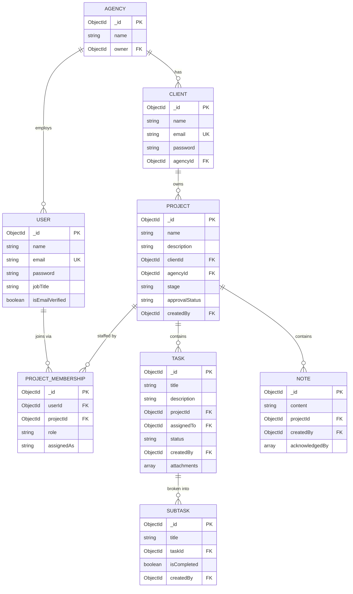
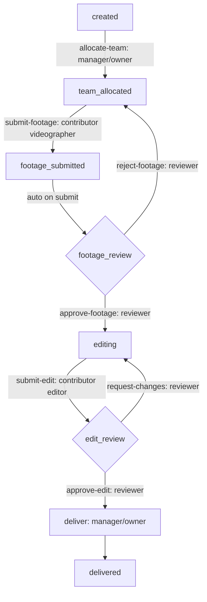

# Product Requirements Document (PRD)

## Creator OS — Backend

**Product Name:** Creator OS
**Version:** 1.0.0 (v1 scope)
**Product Type:** Backend REST API for a creative / marketing agency workflow platform
**Stack:** Node.js, Express, MongoDB (Mongoose), JWT authentication
**Status of this document:** Complete design specification. Build not yet started beyond the inherited authentication layer (see Section 12, Build Status).

---

## 0. How to read this document (handoff note)

This PRD is written so that a person or an AI can pick the project up cold and know (a) what the product is, (b) every design decision and the reasoning behind it, and (c) exactly what work remains. Where a decision had a real trade-off, the reasoning is recorded inline so it is not re-litigated later. Section 12 is the live checklist of what is done versus what remains.

The project began from a generic "project management" tutorial backend. The authentication and authorization scaffolding (JWT, refresh tokens, email verification, password reset) and a standard `ApiError` / `ApiResponse` response wrapper are inherited from that codebase and are reused unchanged. Everything else is purpose-built for the agency domain described here.

---

## 1. Product overview

Creator OS is a backend API for content creators, marketing agencies, and creative agencies to manage their production workflow across multiple clients and projects. A single agency serves many clients; each client may have several projects running at once (for example, a podcast in the review stage and an intro video in the editing stage simultaneously). Each project moves through a defined production pipeline — from creation and team allocation, through videography and review, into editing and final review, and finally to delivery.

The system models the real roles on an agency team (owner, manager, and production crew such as videographers, editors, and designers, plus reviewers) and the real handoffs between them, including a two-gate review process with asymmetric feedback loops. Clients are given limited, read-only access to track status and receive deliverables.

---

## 2. Target users and roles

The system has four **permission roles** plus a separate read-only **client** actor.

| Role | Who they are | Core capability |
|------|--------------|-----------------|
| `owner` | Agency owner | Full oversight; creates projects; approves manager-created projects; final authority |
| `manager` | Team/project lead | Same as owner, but projects they create require owner approval; allocates teams; confirms completion |
| `contributor` | Production crew (videographer, editor, designer) | Does assigned work, uploads deliverables, acknowledges notes, raises issues |
| `reviewer` | Quality reviewer | Reviews work at the two gates, approves/rejects, creates tasks/subtasks for editors, leaves notes |
| *client* | External customer (read-only) | Logs in only to view project status and download deliverables |

### 2.1 Key role decisions and reasoning

**Roles are per-project, not global.** A person does not have one fixed role across the whole system. The same user can be a `manager` on one project and a `reviewer` on another. Role therefore lives on the project membership record (Section 4), not on the user. This is the single most important architectural decision in the product.

**Production crafts are a label, not a permission tier.** Videographer, editor, and designer all have *identical* permissions — they are all `contributor`. The system distinguishes them with a `jobTitle` field, not a separate role. Permissions key off *capability*, not *identity*. This keeps the permission system to four clean bundles and means adding a new craft (e.g. "motion artist") never touches permission logic.

**A user's craft lives on the User; their assignment lives on the membership.** A person's inherent skill (`jobTitle` on User, e.g. "editor") is a stable fact about them and is used by managers when staffing a brand-new project (before any membership exists). What they were actually assigned as on a specific project (`assignedAs` on the membership, optional) can differ. Stable facts about a person go on the person; facts about a relationship go on the relationship.

**Client is a separate actor, not a user role.** Clients authenticate against a separate, restricted set of routes (the client portal) and see a filtered view. They are modeled as their own collection, not as a type of `User`.

---

## 3. Entity model (ER diagram)

The hierarchy is: an Agency contains Clients and Users. Projects belong to Clients. A ProjectMembership joins a User to a Project and carries the per-project role. Tasks belong to Projects; Subtasks belong to Tasks; Notes belong to Projects. File deliverables are embedded inside Tasks.

**Note on references in MongoDB:** Every `...Id` field is an ObjectId reference pointing "upward" to a parent. MongoDB does not enforce these relationships the way SQL foreign keys do — they are a convention the application code maintains. The chain of references (Subtask → Task → Project → Client → Agency) *is* the data hierarchy.

**Note on embedding vs. referencing:** Task attachments (deliverables) are *embedded* as an array inside the Task document rather than living in a separate collection, because a deliverable only ever matters in the context of its task. The rule applied throughout: embed data that lives only inside its parent; reference data that exists independently.

---

## 4. Collections (MongoDB schema)

Eight logical collections. All use Mongoose `{ timestamps: true }` to get `createdAt` / `updatedAt` automatically. Passwords are always stored hashed (handled by the inherited auth layer).

### 4.1 User
Staff members who can log into the agency side.

| Field | Type | Required | Notes |
|-------|------|----------|-------|
| `name` | String | Yes | Display name |
| `email` | String | Yes | **Unique.** Login identifier |
| `password` | String | Yes | Stored hashed |
| `jobTitle` | String | Yes | Inherent craft, e.g. `videographer`, `editor`, `designer`. Used for staffing |
| `isEmailVerified` | Boolean | No | Default `false` |
| auth tokens | String/Date | No | `refreshToken`, `emailVerificationToken`, `forgotPasswordToken` and expiries — transient, from inherited auth |

Deliberately **no `role` field** — role is per-project and lives on the membership.

### 4.2 ProjectMembership
The join document connecting a user to a project. The heart of the design.

| Field | Type | Required | Notes |
|-------|------|----------|-------|
| `userId` | ObjectId → User | Yes | Who |
| `projectId` | ObjectId → Project | Yes | Where |
| `role` | String (enum) | Yes | One of `owner`, `manager`, `contributor`, `reviewer` |
| `assignedAs` | String | No | What they're doing on *this* project (optional craft override) |

**Constraint:** Compound unique index on `(userId, projectId)` — a user can hold only one membership per project.

### 4.3 Project
A body of work for one client.

| Field | Type | Required | Notes |
|-------|------|----------|-------|
| `name` | String | Yes | |
| `description` | String | No | |
| `clientId` | ObjectId → Client | Yes | Which client the work is for |
| `agencyId` | ObjectId → Agency | Yes | Data-isolation field — keeps agencies' data separate |
| `stage` | String (enum) | Yes | Pipeline position. Enum in Section 5. Default `created` |
| `approvalStatus` | String (enum) | Yes | `approved` or `pending`. Owner-created → `approved`; manager-created → `pending` |
| `createdBy` | ObjectId → User | No | Needed to apply the manager-approval rule |

### 4.4 Task
A unit of work inside a project.

| Field | Type | Required | Notes |
|-------|------|----------|-------|
| `title` | String | Yes | |
| `description` | String | No | |
| `projectId` | ObjectId → Project | Yes | |
| `assignedTo` | ObjectId → User | No | May be created before assignment |
| `status` | String (enum) | Yes | `todo`, `in_progress`, `done`. Default `todo`. Contributor-controlled |
| `createdBy` | ObjectId → User | No | |
| `attachments` | Array of `{ url: String, message: String }` | No | **The deliverable** — array of links + optional message, embedded |

### 4.5 Subtask
A checklist item under a task.

| Field | Type | Required | Notes |
|-------|------|----------|-------|
| `title` | String | Yes | |
| `taskId` | ObjectId → Task | Yes | |
| `isCompleted` | Boolean | No | Default `false` |
| `createdBy` | ObjectId → User | No | Often the reviewer |

### 4.6 Note
Feedback / direction attached to a project.

| Field | Type | Required | Notes |
|-------|------|----------|-------|
| `content` | String | Yes | |
| `projectId` | ObjectId → Project | Yes | |
| `createdBy` | ObjectId → User | Yes | Authorship matters for feedback |
| `acknowledgedBy` | Array of ObjectId → User | No | IDs of contributors who acknowledged the note |

### 4.7 Client
The agency's customers. Authenticates against the read-only portal only.

| Field | Type | Required | Notes |
|-------|------|----------|-------|
| `name` | String | Yes | |
| `email` | String | Yes | **Unique.** Portal login |
| `password` | String | Yes | Stored hashed |
| `agencyId` | ObjectId → Agency | Yes | |
| `isEmailVerified` + tokens | mixed | No | Optional for v1 |

A Client looks like a stripped-down User with auth fields but no staff fields — which is exactly why it is a separate collection: it authenticates against a different, far more restricted route tree.

### 4.8 Agency
The top-level container / workspace.

| Field | Type | Required | Notes |
|-------|------|----------|-------|
| `name` | String | Yes | |
| `owner` | ObjectId → User | Yes | Founding owner |

Deliberately minimal for v1. Everything else points at it via `agencyId`. Resist adding billing/settings/plans until something needs them.

---

## 5. Production pipeline (state machine)

The project-level `stage` field is governed by an explicit, encapsulated state machine — a single module holding the legal stages and the legal transitions between them. The pipeline is hardcoded for v1 (it models one workflow: video production) but is contained in one place so it can later be lifted into the database and made configurable without touching every route.

**Two levels of "progress" — do not confuse them:**
- **Project `stage`** (this section): the whole project's position in the pipeline. One value per project. Governed by the state machine. This is what the client sees.
- **Task `status`** (`todo`/`in_progress`/`done`): an individual task's state. Many per project. Simple, contributor-controlled, not part of the state machine.

The project does not auto-advance when tasks complete; a human (reviewer or manager) makes each gate transition deliberately.

### 5.1 Stages

`created → team_allocated → footage_submitted → footage_review → editing → edit_review → delivered`

### 5.2 Pipeline diagram

### 5.3 The critical asymmetry

There are **two review gates**. They behave differently on rejection:
- **Footage review** rejection (`reject-footage`) sends work **back to the videographer** (re-shoot).
- **Edit review** rejection (`request-changes`) sends work **back to the editor only** — never back to the videographer.

Once footage passes its review, the videographer is out of the loop. All subsequent feedback is editor-only. This asymmetry is a defining feature of the workflow and is enforced by the transition map: there is no legal transition from `edit_review` back to any videographer stage.

---

## 6. Permission matrix

Rows are actions at verb-on-noun granularity; columns are the four roles plus the client. This matrix is the backbone of the authorization middleware — it is encoded as a lookup table (e.g. `permissions['contributor']['delete_task'] = false`) that the middleware consults on every request.

Legend: ✓ allowed · — not allowed · ✓\* allowed with condition (see notes).

| Action | Owner | Manager | Contributor | Reviewer | Client |
|--------|:-----:|:-------:|:-----------:|:--------:|:------:|
| **Project** | | | | | |
| Create project | ✓ | ✓\* | — | — | — |
| View project | ✓ | ✓ | ✓ | ✓ | ✓† |
| Update project details | ✓ | ✓ | — | — | — |
| Delete project | ✓ | — | — | — | — |
| Approve pending project | ✓ | — | — | — | — |
| **Membership** | | | | | |
| Add / remove member | ✓ | ✓ | — | — | — |
| Reassign work / change role | ✓ | ✓ | — | — | — |
| **Task & subtask** | | | | | |
| Create task / subtask | ✓ | ✓ | — | ✓ | — |
| View task | ✓ | ✓ | ✓ | ✓ | — |
| Update task content | ✓ | ✓ | ✓ | — | — |
| Change task status | ✓ | ✓ | ✓‡ | ✓‡ | — |
| Delete task / subtask | ✓ | ✓ | — | — | — |
| **Note / feedback** | | | | | |
| Create note | ✓ | ✓ | — | ✓ | — |
| Acknowledge note | — | — | ✓ | — | — |
| Raise issue / request | ✓ | ✓ | ✓ | ✓ | — |
| **Client & deliverables** | | | | | |
| Manage clients | ✓ | ✓ | — | — | — |
| View status / deliverables | ✓ | ✓ | ✓ | ✓ | ✓† |

**Condition notes:**
- ✓\* — Manager creates a project in `approvalStatus: pending`; the owner must approve it.
- ✓† — Client sees a *filtered, read-only* view (status + deliverables only, never internal tasks/notes). Enforced at the route by returning fewer fields, not by blocking access.
- ✓‡ — Permitted to *attempt* status changes, but the state machine decides *which* specific transitions are legal for that role. The matrix is the coarse gate; the state machine is the fine rule.

**Reading the matrix:** The owner and manager rows differ in exactly one cell (create project), cleanly expressing "manager = owner minus final authority." The reviewer row is unusual — almost no administrative power, but high workflow power (creates tasks, approves at gates) — which correctly models a quality lead who directs the editor.

---

## 7. API design

### 7.1 Conventions

- **URL = noun, method = verb.** Collection URLs (`/projects`) for list/create; item URLs (`/projects/:projectId`) for read/update/delete.
- **Nesting mirrors the data hierarchy:** `/projects/:projectId/tasks/:taskId/subtasks/:subtaskId`. Full words, not abbreviations, for readability.
- **PATCH for partial updates** (the common case); reserved PUT is not used.
- **Named action endpoints for meaningful state transitions** (submit, approve, request-changes, allocate-team, deliver). Each maps one-to-one to a pipeline transition and carries a single role guard, so the route list narrates the workflow. Generic PATCH is used only for plain content edits (title/description), which carry no workflow meaning.
- **Request lifecycle per route:** authenticated? (inherited auth) → authorized? (permission matrix guard) → valid? (input validation) → business guards → action runs.
- All routes are prefixed `/api/v1`.

### 7.2 Auth — `/api/v1/auth` (inherited, unchanged)

`POST /register` · `POST /login` · `POST /logout` (secured) · `GET /current-user` (secured) · `POST /change-password` (secured) · `POST /refresh-token` · `GET /verify-email/:verificationToken` · `POST /forgot-password` · `POST /reset-password/:resetToken` · `POST /resend-email-verification` (secured)

### 7.3 Clients — `/api/v1/clients`

| Method & path | Purpose | Guard |
|---------------|---------|-------|
| `GET /` | List clients | owner/manager |
| `POST /` | Create client | owner/manager |
| `GET /:clientId` | Get one client | owner/manager |
| `PATCH /:clientId` | Update client | owner/manager |
| `DELETE /:clientId` | Remove client | owner only |
| `GET /:clientId/projects` | Projects for a client | owner/manager |

### 7.4 Projects — `/api/v1/projects`

| Method & path | Purpose | Guard |
|---------------|---------|-------|
| `GET /` | List projects (filtered to caller's memberships) | any member |
| `POST /` | Create project (owner→approved, manager→pending) | owner/manager |
| `GET /:projectId` | Get one project | member |
| `PATCH /:projectId` | Update plain details | owner/manager |
| `DELETE /:projectId` | Delete project | owner only |
| `PATCH /:projectId/approve` | Owner approves a pending project | owner only |
| `POST /:projectId/allocate-team` | Set crew + advance to `team_allocated` | owner/manager |
| `POST /:projectId/deliver` | Final delivery (from `edit_review`) | manager/owner |

### 7.5 Membership — `/api/v1/projects/:projectId/members`

| Method & path | Purpose | Guard |
|---------------|---------|-------|
| `GET /` | List members | member |
| `POST /` | Add member | owner/manager |
| `PATCH /:userId` | Change member role | owner/manager |
| `DELETE /:userId` | Remove member | owner/manager |

### 7.6 Tasks — `/api/v1/projects/:projectId/tasks`

| Method & path | Purpose | Guard |
|---------------|---------|-------|
| `GET /` | List tasks | member |
| `POST /` | Create task | owner/manager/reviewer |
| `GET /:taskId` | Get one task | member |
| `PATCH /:taskId` | Edit title/description | owner/manager/contributor |
| `DELETE /:taskId` | Delete task | owner/manager |
| `POST /:taskId/submit-footage` | Videographer submits footage | contributor |
| `POST /:taskId/approve-footage` | Reviewer passes footage | reviewer |
| `POST /:taskId/reject-footage` | Reviewer sends footage back | reviewer |
| `POST /:taskId/submit-edit` | Editor submits edit (guarded — see 8.2) | contributor |
| `POST /:taskId/approve-edit` | Reviewer passes edit | reviewer |
| `POST /:taskId/request-changes` | Reviewer bounces to editor | reviewer |

### 7.7 Subtasks — `/api/v1/projects/:projectId/tasks/:taskId/subtasks`

| Method & path | Purpose | Guard |
|---------------|---------|-------|
| `GET /` | List subtasks | member |
| `POST /` | Create subtask | owner/manager/reviewer |
| `PATCH /:subtaskId` | Toggle `isCompleted` / edit | member (contributor flips own) |
| `DELETE /:subtaskId` | Delete subtask | owner/manager/reviewer |

### 7.8 Notes — `/api/v1/projects/:projectId/notes`

| Method & path | Purpose | Guard |
|---------------|---------|-------|
| `GET /` | List notes | member |
| `POST /` | Create note | owner/manager/reviewer |
| `GET /:noteId` | Get one note | member |
| `PATCH /:noteId` | Edit note | author or owner/manager |
| `DELETE /:noteId` | Delete note | author or owner/manager |
| `POST /:noteId/acknowledge` | Contributor acknowledges note | contributor |

### 7.9 Client portal — `/api/v1/portal` (separate, client-authenticated, read-only)

| Method & path | Purpose | Guard |
|---------------|---------|-------|
| `GET /projects` | Client's own projects, status only | client auth, filtered |
| `GET /projects/:projectId` | Status + deliverables, no internal data | client auth + ownership |

Kept as a separate route tree (not folded into `/projects`) so the staff/client access boundary is structural: client routes and staff routes never share a path.

### 7.10 Healthcheck — `/api/v1/healthcheck`

`GET /` — system status. No guard.

---

## 8. Validation and constraints

Validation comes in two distinct layers. Keeping them separate is deliberate: input validation is uniform and library-driven; business guards are bespoke and live inside their handlers because they need to query database state.

### 8.1 Input validation (request shape — handled early, e.g. express-validator / Zod)

Per collection: required fields present and non-empty; `email` matches an email pattern; `role`, `stage`, `status` restricted to their enum values; ID fields are valid ObjectIds. Examples: a project requires non-empty `name` and a valid `clientId`; a task requires non-empty `title`; a note requires non-empty `content`.

### 8.2 Business guards (state of the world — inside the handlers)

Three families:

**Family 1 — Gate guards (right role + right current stage).** Each pipeline transition is only legal from the correct current stage and only by the correct role. The state machine's transition map *is* this guard. Examples: `approve-footage` only from `footage_review` by a reviewer; `approve` (project) only when `pending` by the owner; `deliver` only from `edit_review` by manager/owner. The "right current stage" half prevents illegal jumps (e.g. approving an edit that was never submitted).

**Family 2 — Completeness guards (no unfinished work past a gate).**
- `submit-edit` is **blocked unless all subtasks of the task are complete** (`isCompleted: true`). A task with **zero** subtasks submits freely (nothing required). This is the definition-of-done enforcement.
- Optional: `deliver` may require that at least one deliverable link exists, so a project is never marked delivered with nothing for the client to see.

**Family 3 — Integrity / ownership guards (data stays consistent and isolated).**
- No duplicate membership for the same `(userId, projectId)` (also enforced by the compound unique index).
- A task's `assignedTo` user must be a member of that project.
- A project's `clientId` must reference a client that exists *and shares the same `agencyId`*.
- **Client portal ownership check:** a client can only access projects belonging to their own `clientId`. This is a security boundary (guards against insecure direct object reference / IDOR) — never trust an ID in the URL just because it is well-formed; always verify ownership.

**Why contributors have few guards:** contributors only ever move work *forward into* a review gate, where a human reviewer scrutinizes it next. Guards concentrate at the gates — where trust transfers — not on the people feeding into them.

---

## 9. Response and error format (inherited)

The project reuses the inherited `ApiResponse` and `ApiError` utility classes so every endpoint returns a consistent shape. Every success returns through `ApiResponse`; every failure throws an `ApiError` caught and formatted by error-handling middleware.

Business guards throw `ApiError` with appropriate HTTP status codes:
- `403` — permission or ownership denied
- `404` — resource not found
- `409` — conflict (e.g. duplicate membership)
- `422` — failed precondition (e.g. incomplete subtasks on `submit-edit`)

Requirement: `ApiError` must carry both a status code and a human-readable message so guard failures surface clearly to the frontend.

---

## 10. Security summary

- JWT authentication with refresh tokens (inherited).
- Per-project, role-based authorization via the permission matrix middleware.
- Two-layer validation (input + business guards), including explicit ownership checks against IDOR.
- Separate, restricted client portal route tree with filtered read-only responses.
- Agency-level data isolation via `agencyId` on all major collections.
- Input validation on all endpoints; file/deliverable handling via link submission (and Multer if direct uploads are later added).

---

## 11. Out of scope for v1 (explicit future work)

Recorded so scope creep is a deliberate choice, not an accident:
- Configurable/custom pipelines per agency or project (v1 hardcodes the video workflow as one encapsulated state machine; lifting it into the DB is the documented extension path).
- Deliverable versioning (v1 stores a flat array of links per task).
- Deadlines / scheduling (no date fields on projects or tasks in v1).
- Hard skill-to-craft locking and reviewer/contributor separation-of-duties enforcement — left to manager judgment in v1; the separation-of-duties check is an optional "nice-to-have if time permits" addition (a single membership-creation guard).
- Client email verification flow (optional for v1).
- Notifications system (referenced in workflow but not built as its own subsystem in v1).

---

## 12. Build status and remaining work (live checklist)

**Planning: complete.** Scope, entities, roles, permission matrix, pipeline, schemas, routes, validation, and response format are all specified in this document.

**Implementation status:**

- [x] Authentication & authorization scaffolding (JWT, refresh, email verification, password reset) — inherited, reused unchanged.
- [x] `ApiError` / `ApiResponse` utility classes — inherited, reused.
- [ ] **Schemas & migrations** — implement the 8 Mongoose models in Section 4, including the compound unique index on ProjectMembership. *Do this first; everything depends on it.*
- [ ] **Per-project authorization middleware** — encode the Section 6 matrix as a lookup table; middleware resolves the caller's membership on the target project and checks the cell. *Build and test early; every route depends on it.*
- [ ] **Client + Project CRUD** — the container entities (Sections 7.3, 7.4) plus membership routes (7.5).
- [ ] **State machine module** — the encapsulated transition map from Section 5, with gate guards (Family 1).
- [ ] **Task CRUD + pipeline action endpoints** (7.6), wiring each action to the state machine; then the `submit-edit` completeness guard (8.2, Family 2).
- [ ] **Subtasks, Notes, attachments** (7.7, 7.8) including note acknowledgement.
- [ ] **Client portal** (7.9) — separate route tree with the ownership check (8.2, Family 3).
- [ ] **Integrity guards** (8.2, Family 3) across membership/task/project creation.
- [ ] **Input validation layer** (8.1) on all endpoints.
- [ ] **Healthcheck** (7.10).
- [ ] Final pass: consistent error codes (Section 9), manual API testing.

**Suggested build order rationale:** each item depends on the ones above it. Schemas before middleware (middleware reads memberships); middleware before routes (every route is guarded); plain CRUD before the state machine (so the workflow sits on a solid base); leaf features and the portal last.

---

*End of PRD.*
